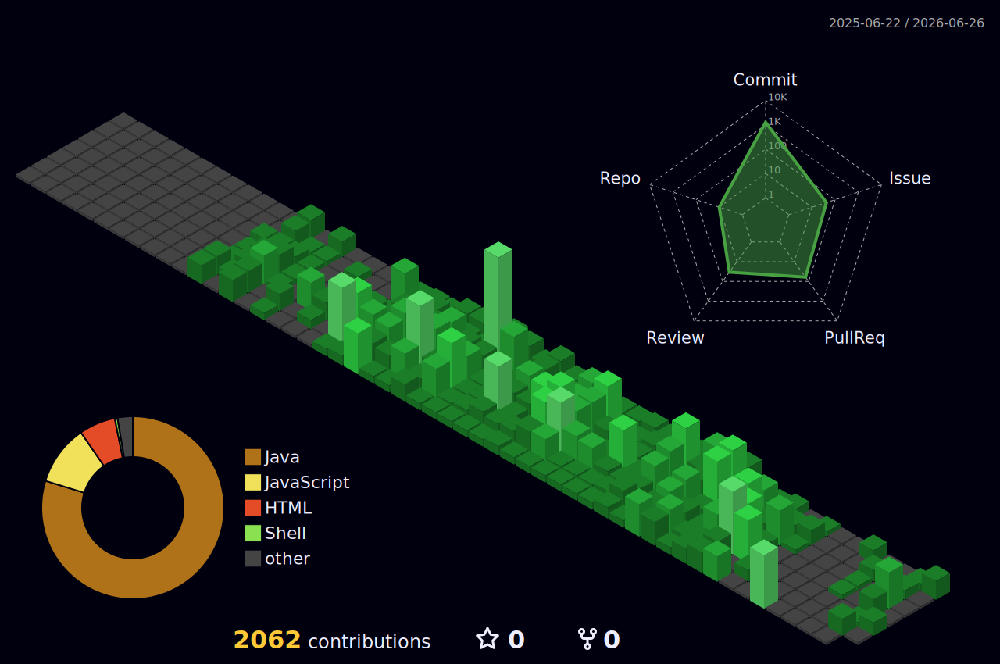

<!-- Header -->

  

## 소개

> **N+1 쿼리와 성능 병목을 분석해 EC2 스로틀링 문제까지 해결한 Java / Spring 백엔드 개발자**

문제를 찾고, 쿼리를 바꾸고, 부하 테스트로 증명하는 방식으로 일합니다.

SQL 로그, 애플리케이션 조회 구조, 인프라 지표를 함께 보며 병목의 원인을 좁히고, 개선 결과를 수치로 남기는 데 집중합니다.

- **성능 병목 분석과 검증**: CalmDesk에서 `GET /api/admin/team/members`의 N+1 병목을 추적해 150회의 단건 쿼리를 3회의 벌크 쿼리로 줄였고, k6 기준 P95 응답 시간을 `377.19ms -> 101.01ms`로 73% 단축했습니다.
- **서비스 단위 구현 경험**: Cubing Hub에서 인증, 기록, 랭킹, 커뮤니티, 테스트, REST Docs, AWS 배포와 운영 검증까지 1인 풀스택으로 완성했습니다.
- **인증·캐시·데이터 조회 설계**: Redis Refresh Token Rotation, Access Token blacklist, Redis ZSET 읽기 모델, Oracle 제약조건과 View 기반 조회 구조를 다뤘습니다.
- **협업 기준 정리**: Git 커밋 컨벤션과 GitHub 이슈/PR 템플릿을 도입해 팀 리뷰 소요 시간을 30% 이상 줄인 경험이 있습니다.

---

## 대표 프로젝트

### CalmDesk

> **5인 팀 프로젝트 · 이슈 관리자 / 실시간 채팅·대시보드·출퇴근·성능 개선 담당**
>
> B2B HR·웰빙 SaaS 통합 관리 플랫폼

- 관리자 팀/멤버 조회 API에서 N+1 쿼리로 인한 DB 부하와 EC2 CPU 크레딧 고갈 원인을 추적했습니다.
- JPA Fetch Join과 Bulk IN 쿼리로 150회의 단건 쿼리를 3회의 벌크 쿼리로 통합했습니다.
- 운영 환경에서 단일 API 응답 지연은 `25초 -> 0.9초` 수준으로 복구했고, k6 50 VUs 기준 P95 `377.19ms -> 101.01ms`, RPS `30.65 req/s -> 35.01 req/s`를 확인했습니다.
- WebSocket(STOMP) 채팅, 소켓 JWT 인증, SSE/비동기 대시보드 갱신, GitHub 협업 템플릿을 담당했습니다.

`Java 17` `Spring Boot` `Spring Security` `Spring Data JPA` `WebSocket` `SSE` `Spring AI` `OpenAI API` `Google Cloud STT` `MySQL` `Redis` `React 19` `Docker` `GitHub Actions` `AWS EC2`

[Team GitHub](https://github.com/Team-Code808) · [N+1 최적화 Fork](https://github.com/xxh3898/CalmDeskBackend) · [트러블슈팅 리포트](https://github.com/Team-Code808/Docs/blob/main/%EC%9D%B4%EC%8A%88/%EB%B0%B1%EC%97%94%EB%93%9C%20CD%20%EB%B0%B0%ED%8F%AC%20%EB%B0%8F%20%EB%8C%80%EC%8B%9C%EB%B3%B4%EB%93%9C%20%EC%84%B1%EB%8A%A5%20%EC%B5%9C%EC%A0%81%ED%99%94.md)

### Cubing Hub

> **1인 풀스택 프로젝트 · 기획 / 설계 / 개발 / 배포 / 검증 전담**
>
> 큐빙 기록·학습·랭킹·커뮤니티·피드백을 통합한 스피드큐빙 웹 플랫폼

- MySQL `user_pbs` 기반 랭킹 조회를 Redis ZSET 읽기 모델로 분리했습니다.
- 300,000 PB 기준 평균 응답 시간 `7,245.23ms -> 21.10ms`, P95 `12,429.58ms -> 36.94ms`, 처리율 `4.21 req/s -> 1,502.77 req/s`를 확인했습니다.
- JWT Access Token, HttpOnly Refresh Cookie, Redis Refresh Token Rotation, Access Token blacklist 기반 세션 무효화를 구현했습니다.
- JUnit 5/MockMvc, Testcontainers, Spring REST Docs, JaCoCo, Vitest, GitHub Actions, AWS 분리 배포와 실제 SMTP/S3/브라우저 수동 QA까지 완료했습니다.

`Java 17` `Spring Boot 3.5.12` `Spring Security` `Spring Data JPA` `QueryDSL` `MySQL 8` `Redis 7` `React 19` `Vite 8` `React Router 7` `AWS EC2/RDS/S3/CloudFront` `Docker Compose` `Nginx` `JUnit 5` `MockMvc` `Testcontainers` `Spring REST Docs` `JaCoCo` `Vitest` `k6` `Spring Boot Actuator` `Prometheus` `Grafana` `SMTP` `Discord Webhook`

[GitHub](https://github.com/xxh3898/cubing-hub) · [Service](https://www.cubing-hub.com) · [README](https://github.com/xxh3898/cubing-hub#readme)

### MediFlow

> **6인 팀 프로젝트 · DB Lead / 근태 자동화 담당**
>
> 병원 예약·진료·근태·ERP 운영 흐름을 통합한 JSP 기반 병원 ERP 시스템

- ERD 설계, FK/CHECK 제약조건, 상태값 기준을 정리해 데이터 무결성 기준을 세웠습니다.
- Oracle `LISTAGG`, 서브쿼리, View로 병원 업무 데이터 조회 구조를 정리했습니다.
- 상태 컬럼 표준화와 공통 더미 데이터 재배포로 DB 병합 충돌과 정합성 문제를 줄였습니다.
- `LocalTime` 기반 출퇴근 상태 자동 판별과 근태 신청/승인 흐름을 구현했습니다.

`Java` `Spring Boot` `MyBatis` `Oracle` `JSP` `JSTL` `jQuery` `Axios`

[GitHub](https://github.com/Team-W3C/W3C-Project) · [README](https://github.com/Team-W3C/W3C-Project#readme)

---

## 기술 스택

| 분류 | 기술 |
| :--- | :--- |
| **Core Backend** |       |
| **Backend Experience** |      |
| **AI / External** |    |
| **Database / Cache** |    |
| **Infra / DevOps** |          |
| **Frontend** |           |
| **Testing / Quality** |        |
| **Observability** |   |
| **Collaboration / Tools** |        |
| **Legacy / Experience** |      |

---

## GitHub 통계

 

---

## Connect

  
  
  

  Last updated: 2026.04

---

<!-- Footer -->

  

